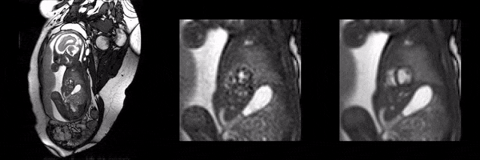
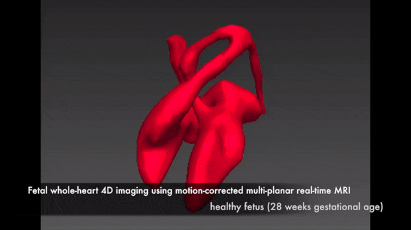

# Fetal CMR

Software and methodologies for magnetic resonance imaging of the fetal heart.

## Contents

* [2D Cardiac Cine](#2d)
* [4D Whole-Heart Imaging](#4d)
* [MOG-Philips](#mog_philips)

---

 

 

## 2D Fetal Cardiac Cine

2D fetal cardiac cine imaging using highly-accelerated dynamic MRI and retrospective motion correction.

### Code Repository

[github.com/jfpva/fetal_cmr_cine_2d](https://github.com/jfpva/fetal_cmr_cine_2d#readme)

### Publications

**Fetal cardiac cine imaging using highly accelerated dynamic MRI with retrospective motion correction and outlier rejection.**  
*JFP van Amerom, DFA Lloyd, AN Price, M Kuklosova-Murgasova, P Aljabar, SJ Malik, MA Rutherford, K Pushparajah, R Razavi, JV Hajnal.*  
2017. Magn. Reson. Med., 79: 327-338. doi:[10.1002/mrm.26686](https://doi.org/10.1002/mrm.26686)

---

 

## 4D Fetal Whole-Heart Imaging

4D depiction of the fetal heart and great vessels using a highly-accelerated multi-planar real-time 2D balanced steady state free precession acquisition combined with retrospective image-domain techniques for motion correction, cardiac synchronisation and outlier rejection. 

### Code Repository

[github.com/mriphysics/fetal_cmr_4d](https://github.com/mriphysics/fetal_cmr_4d#readme)

### Publications

**Fetal whole-heart 4D imaging using motion-corrected multi-planar real-time MRI.**  
*JFP van Amerom, DFA Lloyd, M Deprez, AN Price, SJ Malik, K Pushparajah, MPM van Poppel, MA Rutherford, R Razavi, JV Hajnal.*   
2019. Magn. Reson. Med. doi: [10.1002/mrm.27798](https://doi.org/10.1002/mrm.27798)

**Fetal whole-heart 4D imaging using motion-corrected multi-planar real-time MRI (video)**  
2018. figshare. doi: [10.6084/m9.figshare.7413566](https://doi.org/10.6084/m9.figshare.7413566)

---

 

## MOG Philips

An extension of [MOG-Public](https://github.com/MetricOptimizedGating/MOG-Public) for metric-based gating of cardiac MRI for fetal imaging on Philips scanners.

### Code Repository

[github.com/jfpva/MOG-Philips](https://github.com/jfpva/MOG-Philips#readme)

---
