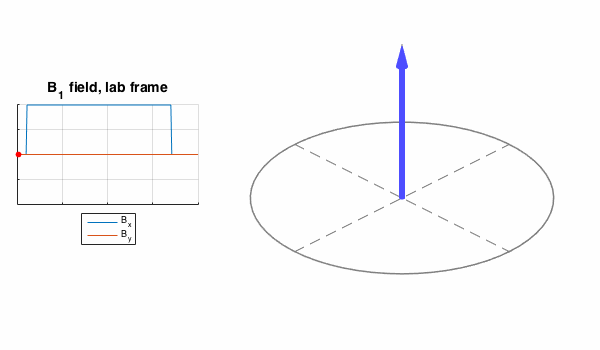
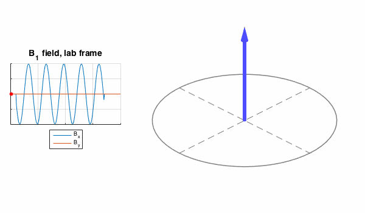
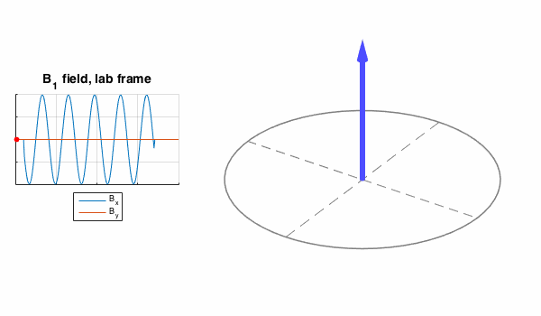
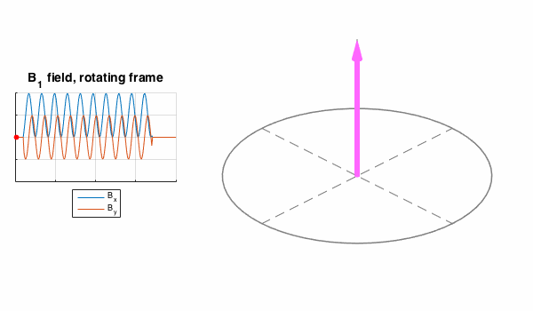
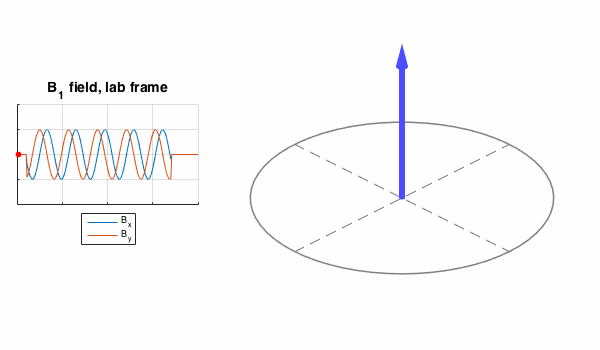
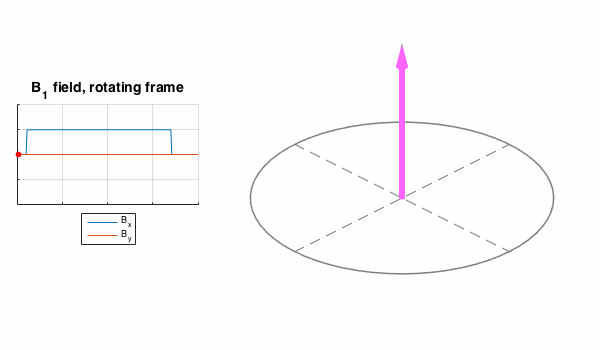
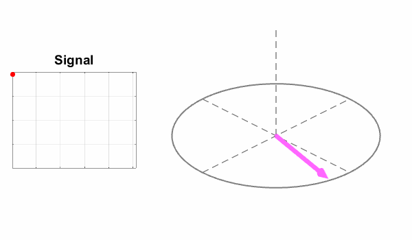
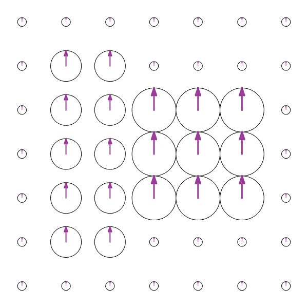
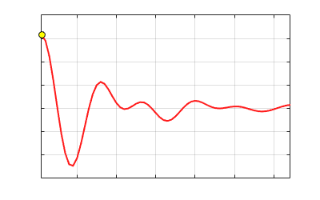

# Introductory MRI Physics: supplementary animations

## NMR basics

In the following plots, the pink arrow corresponds to induced nuclear magnetization \\(\mathbf{M}\\) and the blue arrow is the effective rotation axis given by the magnetic field vector \\(\mathbf{B}\\).  If we imagine applying a constant magnetic field in the x-direction, the magnetization vector would precess around the effective field direction:

But this wouldn't give us what we want. Instead we use a magnetic field that is
oscillating at the Larmor frequency, usually refered to as \\(B_1\\). If we use
an x polarised field, i.e. \\( \mathbf{B} = [B_1 \cos \omega t \quad 0 \quad B_0] \\) then we get the following:

Now \\(\mathbf{M}\\) does tip down. The reason is that the direction of the B1 field reverses as the magnetization vector also changes direction, hence it keeps tipping it down. This is easier seen in a rotating reference frame:

The vector's motion is jerky because the rotation axis (defined by \\(B_x\\)) is not always tipping \\(\mathbf{M}\\) down. This is easier to see in a rotating reference frame where the Larmor precession is removed:

A better solution is to use a **circularly polarized** B1 field - \\( \mathbf{B} = [B_1 \cos \omega t \quad -B_1 \sin \omega t \quad B_0] \\). This has the property of constantly changing direction; at the resonant frequency the field constantly changes to match the precession direction of \\(\mathbf{M}\\) hence always tips it down:

The effective magnetic field direction in the rotating frame is now fixed:

If you scroll back up, notice that the linearly polarised field had twice the amplitude of the circularly polarized field, but achieved the same flip angle - \\(90^\circ\\). This is because linear polarization is less efficient than circular polarization, as it doesn't always tip down. This is important for MRI - circular polarization is used because it is more efficient

One final word on this: *what happens if we use a circularly polarised field that is rotating in the wrong direction*? i.e. what if we have \\( \mathbf{B} = [B_1 \cos \omega t \quad B_1 \sin \omega t \quad B_0] \\)? Now the field rotates in the opposite direction to the precessing magnetization so it is hardly ever optimally oriented to rotate \\(\mathbf{M}\\) into the transverse plane:

The result is that \\(\mathbf{M}\\) doesn't tip. This component of the \\(B_1\\) field doesn't contribute to the NMR at all.

### Relaxation Effects

Magnetization returns to thermal equilibrium by multiple means, resulting in longitudinal recovery with time constant T1 and transverse decay with time constant T2.

#### Longitudinal relaxation

#### Transverse relaxation

Transverse relaxation can be subdivided into irreversible decay due to random interactions (T2):

and reversible decay due to microscopic (but constant) field perturbations (T2'):

The reversible decay can be recovered by applying a second RF pulse to form a **SPIN ECHO**

More generally, after excitation by 90 degree pulse, the magnetization will return to equilibrium by a combination of T1 and T2 relaxation. This is called a **Free Indunction Decay (FID)**

Note that \\(\mathbf{M}\\) *does not* rotate back to equilibrium - the transverse and longitudinal relaxation components are independent. Note also that the Larmor frequency here is exaggeratedly small. In reality \\(\omega\\) is in the range of 100MHz, making one period of rotation about 10ns, whereas the relaxation times are in the range of 10s to 100s of milliseconds. Hence the precession rotation depicted here would in reality be much faster (this is true for all the diagrams on this page) but has been slowed down to make easier to interpret.

 
 

## Spatial Encoding

### Gradient Waveforms
Applied gradient fields can be characterized by a time variable waveform:

 

### Spin Warp method
Imagine we are imaging an object with this spin density:

After excitation, the transverse magnetization is precessing when viewed in the laboratory frame:

If a gradient is applied in the x-direction (Left to Right) we get spatial variation in precession frequency that means some move faster and some slower than the Larmor frequency:

If a gradient is applied in the y-direction, the same is true:

**Phase Encoding** involves applying gradients first in one direction and then another. This is best described in the k-space formalism and results in a combination of the above effects. The observed signal is always the integral over the entire sample, for example:

This will be different for each applied gradient, and each gradient maps out a trajectory in k-space. We can plot the signals as a function of k, and then use an inverse FT to reconstruct the image.

(c) Shaihan Malik 2016
