# Introductory MRI Physics: supplementary animations

## Tipping of Magnetization by RF field

An applied B1 field will tip M into the transverse plane.
This appears as a spiraling rotation in the laboratory frame of reference:

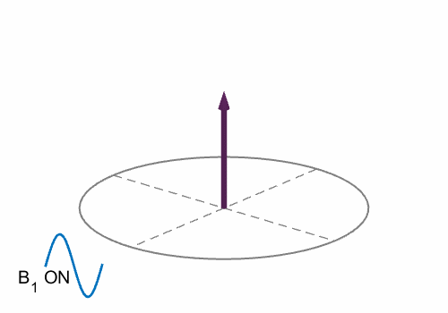

It is useful to view the same process in a frame of reference rotating at the Larmor frequency:

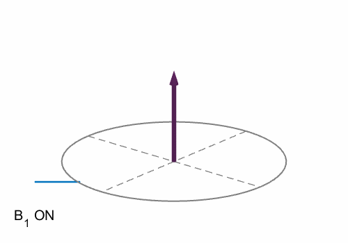

### Relaxation Effects

Magnetization returns to thermal equilibrium by multiple means, resulting in longitudinal recovery with time constant T1 and transverse decay with time constant T2.

#### Longitudinal relaxation

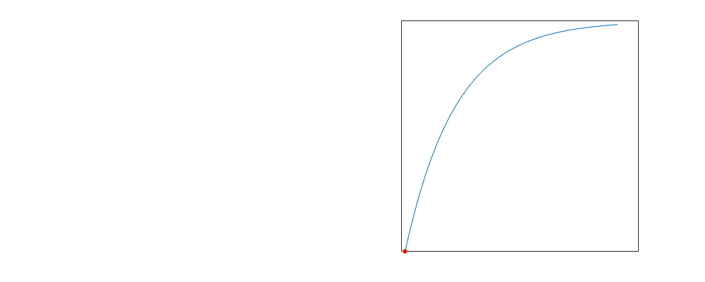

#### Transverse relaxation

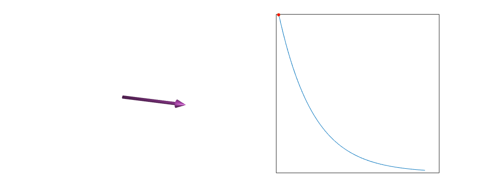

Transverse relaxation can be subdivided into irreversible decay due to random interactions (T2):

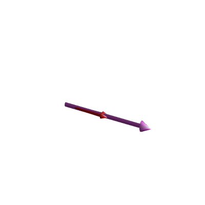

and reversible decay due to microscopic (but constant) field perturbations (T2'):

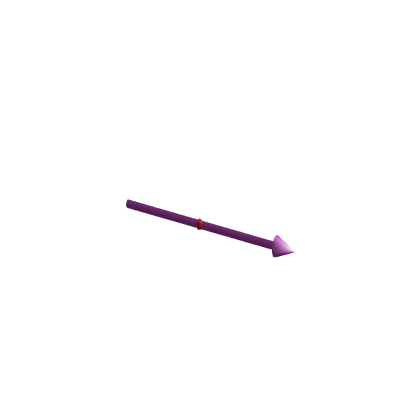

The reversible decay can be recovered by applying a second RF pulse to form a **SPIN ECHO**
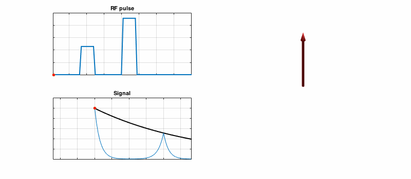

## Spatial Encoding

### Gradient Waveforms
Applied gradient fields can be characterized by a time variable waveform:

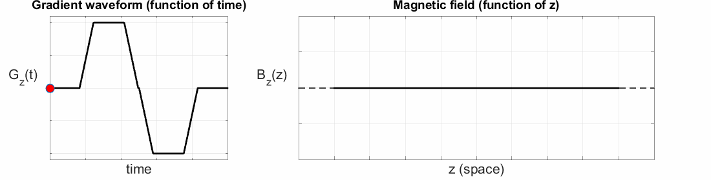

### Spin Warp method

After excitation, when viewed in the rotating frame we have stationary magnetization in the transverse plane:

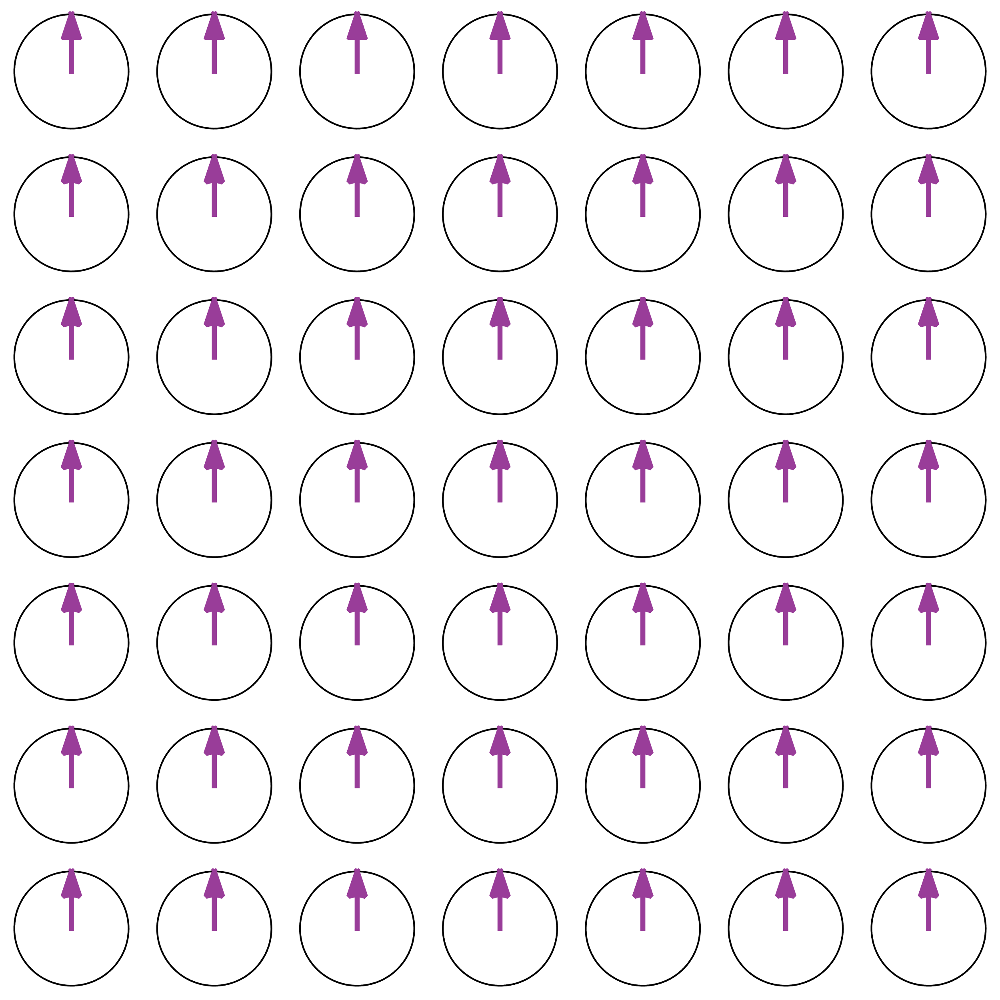

If a gradient is applied in the x-direction (Left to Right) we get spatial variation in precession frequency that means some move faster and some slower than the Larmor frequency. In the rotating frame this is seen as a slow drift:

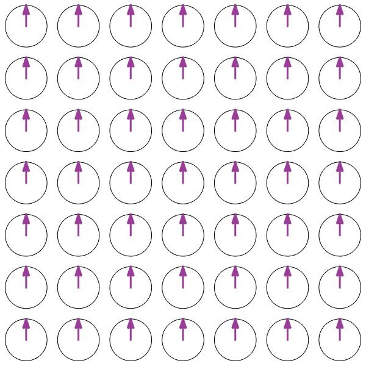

If a gradient is applied in the y-direction, the same is true:

**Phase Encoding** involves applying gradients first in one direction and then another. This is best described in the k-space formalism, however we can visualise the effect of applying a y-directed gradient followed by x below:

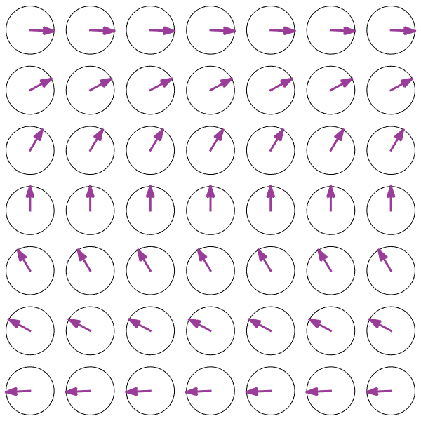

(c) Shaihan Malik 2016
